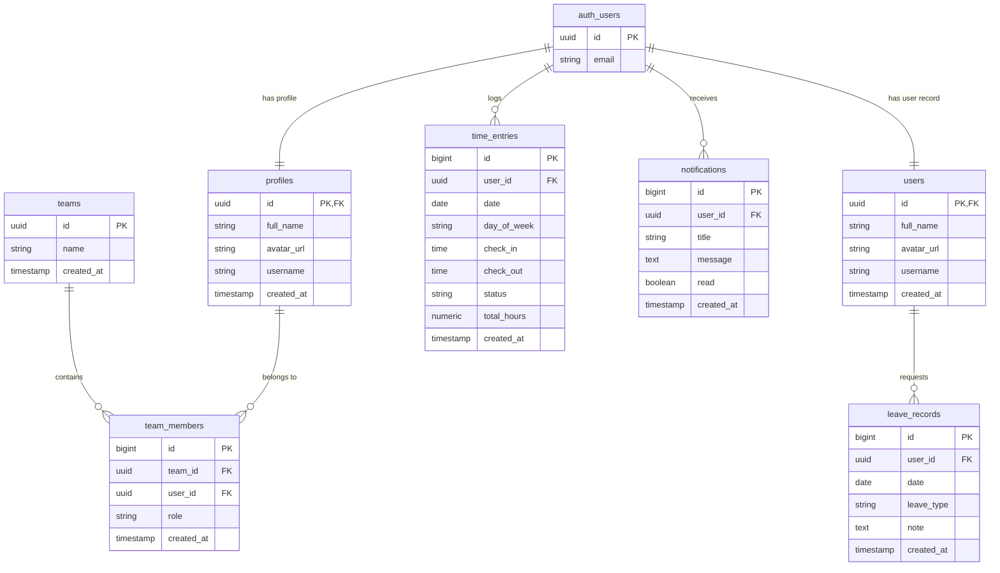

# Timekeeper 🕒

[](https://vite.dev/)
[](https://react.dev/)
[](https://supabase.com/)
[](https://tailwindcss.com/)
[](https://tanstack.com/query/latest)

A premium, responsive, and robust hour-tracking and leave-management web application. **Timekeeper** enables employees to track daily work sessions, request leaves, view dashboard statistics, receive real-time notifications, and export reports, all secured via **Supabase Row-Level Security (RLS)**.

---

## 🌟 Key Features

-  **Clock In & Out**: Log working hours instantaneously in Indian Standard Time (IST). Smart calculations automatically handle overnight shifts correctly.
-  **Leave Management**: Submit applications for Paid, Unpaid, or Casual leaves. Features monthly restriction check rules (e.g. max 1 paid leave per month) and dynamic balance trackers.
-  **Insightful Dashboard**: Interactive charts displaying weekly totals, daily averages, and a comparison with the previous week's performance.
-  **Real-Time Notification Center**: Automatic notifications synced using PostgreSQL PubSub channels when time entries are created, modified, or completed.
-  **Team Presence**: Tracks online/active users using Supabase Presence.
-  **CSV Data Exports**: Download customizable exports of your work hours or leave records filtering by month.

---

## 🏗️ Architecture & Database Security

Security is configured directly inside PostgreSQL using **Supabase Row-Level Security (RLS)**. No user can read, create, or alter another user's time entries or leave requests.

### Data Flow Architecture

```mermaid
graph TD
    User([User Browser]) -->|Actions: Clock In/Out, Apply Leaves| React[React App (Vite)]
    React -->|Auth: Sign In/Up| Auth[Supabase Auth]
    React -->|Queries / Mutations| PostgREST[Supabase PostgREST API]
    React -->|Real-time Subscriptions| Realtime[Supabase Realtime Channel]
    
    subgraph Supabase Backend
        Auth -->|Creates User Row| Trigger[Auth Trigger: handle_new_user]
        Trigger -->|Inserts Profile| Profiles[(public.profiles)]
        Trigger -->|Inserts User| Users[(public.users)]
        
        PostgREST -->|Validates Permissions| RLS[Row Level Security Policies]
        RLS -->|Reads/Writes Data| DB[(PostgreSQL Database)]
        
        DB -->|PubSub Notify| Realtime
    end
    
    DB --> TimeEntries[(public.time_entries)]
    DB --> LeaveRecords[(public.leave_records)]
    DB --> Notifications[(public.notifications)]
    
    style React fill:#646CFF,stroke:#fff,stroke-width:2px,color:#fff
    style Auth fill:#3ECF8E,stroke:#fff,stroke-width:2px,color:#fff
    style PostgREST fill:#3ECF8E,stroke:#fff,stroke-width:2px,color:#fff
    style Realtime fill:#3ECF8E,stroke:#fff,stroke-width:2px,color:#fff
    style Profiles fill:#444,stroke:#fff,color:#fff
    style Users fill:#444,stroke:#fff,color:#fff
```

### Entity-Relationship Diagram (ERD)



### Database Table Schema

| Table Name | Primary Key | Description | RLS Policy Rules |
| :--- | :--- | :--- | :--- |
| `profiles` | `id` (UUID) | User metadata (Synced from Auth) | Authenticated Read / Owner Update |
| `users` | `id` (UUID) | Redundant client helper (Synced from Auth) | Authenticated Read / Owner Update |
| `time_entries` | `id` (BIGINT) | Logged clock sessions | Owner Only (Read/Insert/Update/Delete) |
| `leave_records` | `id` (BIGINT) | Requested leave days & types | Owner Only (Read/Insert/Update/Delete) |
| `notifications` | `id` (BIGINT) | Alert messages for activities | Owner Only (Read/Update/Insert) |
| `teams` | `id` (UUID) | Department structure | Member Read Only |
| `team_members` | `id` (BIGINT) | Connects users to teams | Member Read Only |

---

## 🚀 Setup & Installation

### 1. Prerequisites

- [Node.js](https://nodejs.org/) (v18.x or higher)
- A [Supabase](https://supabase.com/) Account

### 2. Install Dependencies

Clone this repository to your machine, open your shell inside the folder, and run:

```bash
npm install
```

### 3. Database Schema Setup

Set up your Supabase database with the required tables (`profiles`, `users`, `time_entries`, `leave_records`, `notifications`, `teams`, `team_members`), indexes, functions, triggers, and Row-Level Security (RLS) policies. Refer to the previous schema setup files or database instructions to configure these tables.

### 4. Configuration

Create a `.env` file in the root folder of the project:

```env
VITE_SUPABASE_URL=https://your-project-id.supabase.co
VITE_SUPABASE_ANON_KEY=your-project-anon-key
```

> [!WARNING]
> Keep the environment variable names exactly as shown. Using `VITE_SUPABASE_PUBLISHABLE_KEY` instead of `VITE_SUPABASE_ANON_KEY` will cause the Supabase client connection to fail.

### 5. Running the Application

To run the application locally in development mode:

```bash
npm run dev
```

Open [http://localhost:5173](http://localhost:5173) in your browser.

---

## 📂 Folder Layout

```text
├── src/
│   ├── components/       # Reusable UI & presentation components
│   │   ├── dashboard/    # Clocking triggers, charts, and activity summaries
│   │   ├── leave/        # Interactive submission forms for leave days
│   │   ├── ui/           # Custom reusable primitives (Radix + Custom CSS)
│   │   └── notifications/# Dropdowns for database alerts
│   ├── hooks/            # Custom hooks (Auth state management, dynamic timers, popups)
│   ├── lib/              # Core configs, query setups, and helper files
│   │   ├── api.js        # React Query handlers for requests
│   │   └── supabase.js   # DB connection configs & real-time hooks
│   ├── pages/            # View pages (Dashboard, Export, Auth, Leave, Entries)
│   ├── styles/           # Custom calendar configurations
│   ├── App.jsx           # App shell layout and router
│   └── main.jsx          # Mount wrapper
├── .env                  # Project secrets configuration
├── .gitignore            # Git exclusion rules
└── vite.config.ts        # Vite config properties
```
